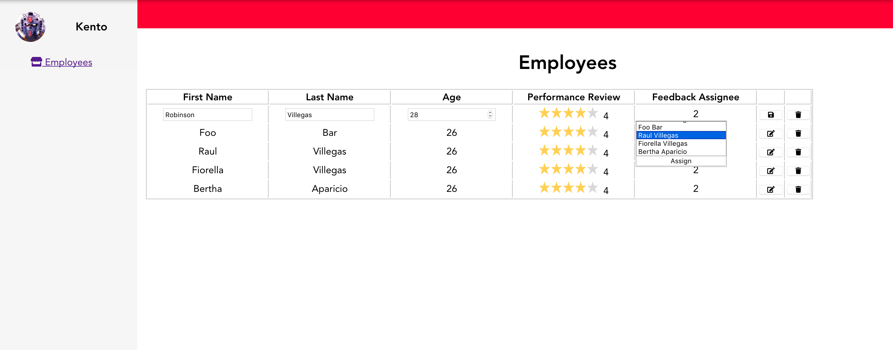
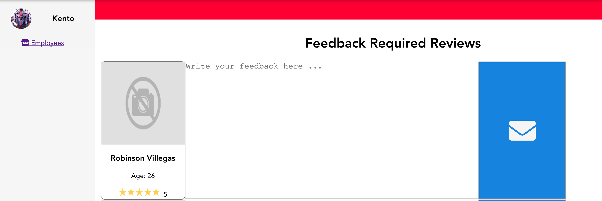
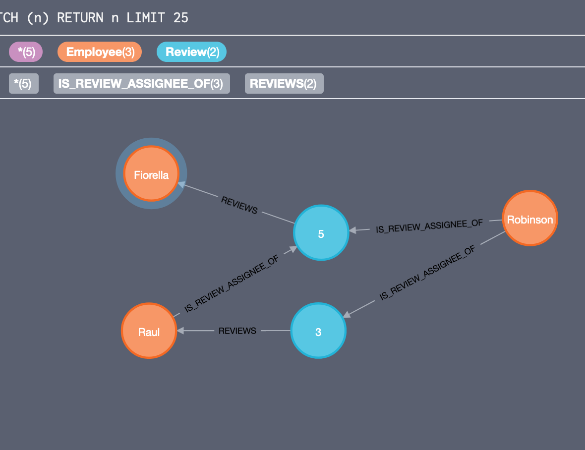

# Performance Review App

## Languages, Frameworks and Tools used
* **Client App:** SPA, VueJs, Vuex, SCSS, SUIT CSS Style methodology
* **Server App:** ASPNET Core 2.2, Neo4J, xUnit, AutoFixture, NSubstitute

## Assumptions made
* Assume this application is just a small module or piece of a big scale application so I focused on maintainability and writing shared components and c# shared projects (extensibility, ex: change db driver, etc).

* Assume we decide to handle most of the logic on backend side. Performance Review ˆ& Review Feedback assignemnt would be handled on server side in just one API call. That's why I decided to create a single reusable component (Table) that allows users to modify employee, assign feedback review to employees and submit performarce review or update the last one (we would need a new button to create a new review instead of updating the existing one, this would affect employees assigned to write a feedback to the existing one, this could be the desired behavior if we want to submit performance review each term and want to save the old reviews with its feedbacks).

## Status
Unfortunately client app is not connected to the WIP backend. I decided to use json-server for quick demo and development purpose (So none of the below specs are persisting in db).

#### Run
```
cd ./solution/ui && npm install
```
```
npm run json-server
```
```
npm run serve
```
and go to http://localhost:8080

### *Client:*


### Admin view
* Add/remove/update/view employees
* Add/update/view performance reviews
* Assign employees to participate in another employee's performance review

### Employee view
* List of performance reviews requiring feedback
* Submit feedback

### *Server:*

This is how our database looks like with employees and reviews

#### Run
```
cd ./solution/server/FullStackChallenge && dotnet build
```
```
cd ./FullStackChallenge.Web.API/ && dotnet run
```

#### Test
```
cd ./solution/server/FullStackChallenge/FullStackChallenge.UnitTests
```
```
dotnet test
```
